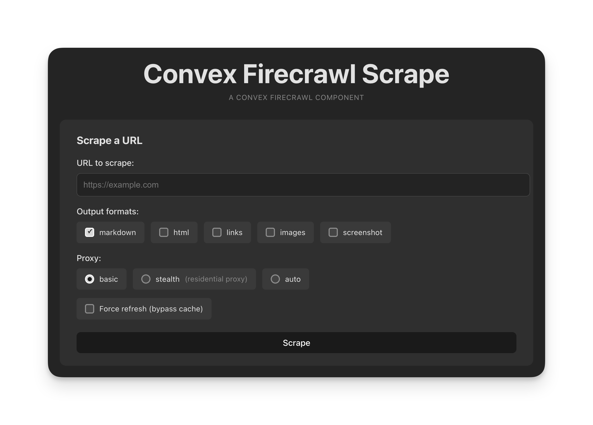

# Convex Firecrawl Scrape Component

[](https://www.npmjs.com/package/convex-firecrawl-scrape)

<p align="center">
  
</p>

<!-- START: Include on https://convex.dev/components -->

Scrape any URL and get clean markdown, HTML, screenshots, or structured JSON -
with durable caching and reactive queries.

```ts
const { jobId } = await scrape({ url: "https://example.com" });
// Status updates reactively as the scrape completes
const status = useQuery(api.firecrawl.getStatus, { id: jobId });
```

- **Durable caching** with configurable TTL (default 30 days)
- **Reactive status updates** via Convex subscriptions
- **Multiple output formats**: markdown, HTML, raw HTML, screenshots, links,
  images, AI summaries
- **JSON extraction** via schema-based LLM processing
- **Built-in SSRF protection** blocks private IPs and localhost
- **Secure by default** with required auth wrapper

**[Live Demo](https://convex-firecrawl-scrape.vercel.app/)** |
[Example Code](./example)

Play with the example:

```sh
git clone https://github.com/gitmaxd/convex-firecrawl-scrape.git
cd convex-firecrawl-scrape
npm install
npm run dev
```

## Pre-requisite: Convex

You'll need an existing Convex project. Convex is a hosted backend platform with
a database, serverless functions, and more. Learn more
[here](https://docs.convex.dev/get-started).

Run `npm create convex` or follow any of the
[quickstarts](https://docs.convex.dev/home) to set one up.

## Installation

```sh
npm install convex-firecrawl-scrape
```

Install the component in your `convex/convex.config.ts`:

```ts
// convex/convex.config.ts
import { defineApp } from "convex/server";
import firecrawlScrape from "convex-firecrawl-scrape/convex.config.js";

const app = defineApp();
app.use(firecrawlScrape);
export default app;
```

Set your Firecrawl API key:

```sh
npx convex env set FIRECRAWL_API_KEY your_api_key_here
```

Get your API key at [firecrawl.dev](https://firecrawl.dev).

## Usage

**Always use `exposeApi()` to expose component functionality.** This wrapper
enforces authentication and controls API key access.

```ts
// convex/firecrawl.ts
import { exposeApi } from "convex-firecrawl-scrape";
import { components } from "./_generated/api";

export const { scrape, getCached, getStatus, getContent, invalidate } =
  exposeApi(components.firecrawlScrape, {
    auth: async (ctx, operation) => {
      const identity = await ctx.auth.getUserIdentity();
      if (!identity) throw new Error("Unauthorized");
      return process.env.FIRECRAWL_API_KEY!;
    },
  });
```

### React Integration

```tsx
import { useMutation, useQuery } from "convex/react";
import { api } from "../convex/_generated/api";
import { useState } from "react";

function ScrapeButton({ url }: { url: string }) {
  const [jobId, setJobId] = useState<string | null>(null);
  const scrape = useMutation(api.firecrawl.scrape);
  const status = useQuery(
    api.firecrawl.getStatus,
    jobId ? { id: jobId } : "skip",
  );
  const content = useQuery(
    api.firecrawl.getContent,
    jobId && status?.status === "completed" ? { id: jobId } : "skip",
  );

  return (
    <div>
      <button
        onClick={async () => setJobId((await scrape({ url })).jobId)}
        disabled={status?.status === "scraping"}
      >
        {status?.status === "scraping" ? "Scraping..." : "Scrape"}
      </button>
      {status?.status === "completed" && <pre>{content?.markdown}</pre>}
      {status?.status === "failed" && <p>Error: {status.error}</p>}
    </div>
  );
}
```

### Output Formats

```ts
const { jobId } = await scrape({
  url: "https://example.com",
  options: {
    formats: ["markdown", "html", "links", "images", "screenshot"],
    storeScreenshot: true,
  },
});
```

| Format       | Description                                             |
| ------------ | ------------------------------------------------------- |
| `markdown`   | Clean markdown content (default)                        |
| `html`       | Cleaned HTML                                            |
| `rawHtml`    | Original HTML source                                    |
| `links`      | URLs found on the page                                  |
| `images`     | Image URLs found on the page                            |
| `summary`    | AI-generated page summary                               |
| `screenshot` | Screenshot URL (use `storeScreenshot: true` to persist) |

### JSON Extraction

Extract structured data using a JSON schema:

```ts
const { jobId } = await scrape({
  url: "https://example.com/product",
  options: {
    extractionSchema: {
      type: "object",
      properties: {
        name: { type: "string" },
        price: { type: "number" },
      },
      required: ["name", "price"],
    },
  },
});

const content = await getContent({ id: jobId });
console.log(content.extractedJson); // { name: "Widget", price: 99.99 }
```

### Cache Management

Cached results use **superset matching**: a cache entry with
`["markdown", "screenshot"]` satisfies a request for `["markdown"]`.

```ts
// Check cache
const cached = await getCached({ url: "https://example.com" });

// Force refresh
const { jobId } = await scrape({ url, options: { force: true } });

// Invalidate cache
await invalidate({ url: "https://example.com" });
```

### Proxy Options

For anti-bot protected sites:

```ts
const { jobId } = await scrape({
  url: "https://protected-site.com",
  options: {
    proxy: "stealth", // Residential proxy
    waitFor: 3000, // Wait for dynamic content
  },
});
```

## Security

**Always use `exposeApi()`** - never expose component functions directly to
clients. Server-side code _can_ call component internals directly, but doing so
bypasses authentication. It ensures:

- Authentication before any operation
- API key controlled by your callback, not callers
- Operation-specific authorization support

```ts
// ❌ DANGEROUS - bypasses auth
export const scrape = components.firecrawlScrape.lib.startScrape;

// ✅ SAFE - auth enforced
export const { scrape } = exposeApi(components.firecrawlScrape, { auth: ... });
```

**SSRF Protection**: Built-in validation blocks localhost, private IPs, and
non-HTTP schemes.

For domain allowlists, rate limiting, and detailed security guidance, see
[docs/SECURITY.md](./docs/SECURITY.md).

## Error Handling

```ts
const status = await getStatus({ id: jobId });
if (status?.status === "failed") {
  console.error(status.error, status.errorCode);
  // errorCode is the HTTP status or error code from Firecrawl (e.g., 402, 429, "BAD_REQUEST")
}
```

Found a bug? Feature request?
[File it here](https://github.com/gitmaxd/convex-firecrawl-scrape/issues).

<!-- END: Include on https://convex.dev/components -->

## Advanced Usage

For configuration options, the `FirecrawlScrape` class API, and URL utilities,
see [docs/ADVANCED.md](./docs/ADVANCED.md).

## Development

```sh
npm install
npm run dev
```

## License

Apache-2.0
